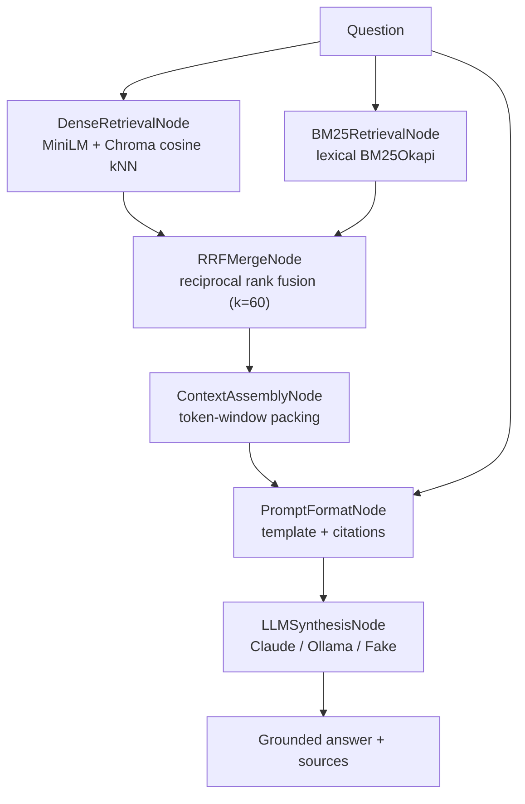

<div align="center">


</div>

# DocSense — Document Intelligence as a Declarative DAG

**Ask questions of your PDFs and get answers with page-level citations.** DocSense ingests documents (running OCR on scanned pages automatically), retrieves the relevant passages with a hybrid lexical + semantic search, and has an LLM synthesise a grounded answer. The whole question-answering flow is built as an explicit **Directed Acyclic Graph (DAG)** of small, typed nodes — so each stage (retrieve, fuse, assemble, prompt, synthesise) can be read, tested, and swapped in isolation.

<div align="center">

[](https://www.python.org/)
[](https://fastapi.tiangolo.com/)
[](https://pytest.org/)
[](https://opensource.org/licenses/MIT)

</div>

---

## The problem

RAG systems are easy to prototype and hard to maintain. Written as one long procedural script, the ingest → retrieve → fuse → prompt → generate flow becomes a tangle: changing the chunker perturbs retrieval, swapping the embedding model quietly changes fusion, and there is no clean seam to unit-test a single stage. You end up afraid to touch it.

DocSense treats the pipeline as a **graph of pure functions**. Each stage is a node with declared dependencies and a typed result; a runner topologically orders them and passes each node exactly the upstream outputs it asked for. Swapping a retriever or the LLM backend is a local change to one node, not a rewrite.

## What it does

- **Ingests PDFs** — extracts text from digital PDFs, and falls back to OCR (Tesseract) for scanned pages, recording a per-page confidence score.
- **Indexes** — chunks pages, embeds them with an ONNX MiniLM model, and stores vectors in ChromaDB alongside a BM25 lexical index.
- **Answers questions** — retrieves candidates from both retrievers, fuses them, packs a context window, and streams an LLM answer that cites the source `doc_id` and page for every claim.
- **Swaps LLM backends** — Anthropic Claude, a local Ollama model, or a deterministic `fake` provider for offline tests and CI, selected by config.

## How it works

The question-answering flow is assembled by `build_doc_qa_dag()` and run by a topological graph executor (`dag/graph.py`, Kahn's algorithm with cycle detection). Dense and lexical retrieval have no dependencies, so they are independent branches that both feed the fusion node:



Each node exposes a `name`, a `dependencies` list, and an `execute(inputs, context)` method (`dag/node.py`). The runner validates the dependency graph, orders nodes topologically, and hands each one only the outputs of its declared upstreams — so a node cannot secretly depend on global state.

| Node | Role |
|---|---|
| `DenseRetrievalNode` | Embeds the question and pulls nearest-neighbour chunks from Chroma |
| `BM25RetrievalNode` | Scores chunks by lexical term frequency (BM25Okapi) |
| `RRFMergeNode` | Fuses the two ranked lists with Reciprocal Rank Fusion |
| `ContextAssemblyNode` | Packs top hits into a bounded context window (`max_context_chars`) |
| `PromptFormatNode` | Binds context + question into the grounded prompt template |
| `LLMSynthesisNode` | Calls the configured provider to synthesise the cited answer |

## Retrieval methodology

Dense and lexical retrievers return incomparable scores — cosine similarity is bounded, BM25 is not — so DocSense never tries to normalise one against the other. It fuses them by **rank** instead. Each document's fused score sums the reciprocal of its rank in each list:

$$\text{RRF}(d) = \sum_{r \in \{\text{dense},\,\text{BM25}\}} \frac{1}{k + \text{rank}_r(d)}, \qquad k = 60$$

A document ranked highly by either retriever surfaces; a document ranked highly by both dominates. The constant `k = 60` damps the influence of low-rank positions. This is implemented identically in the DAG (`RRFMergeNode`) and in the standalone `retrieval/hybrid.retrieve()` helper used by evaluation. Setting `retrieval.hybrid: false` in the config drops BM25 and runs dense-only.

## Watching an ingest happen

`/ask` streams, because nobody wants to stare at a blank box while a model
writes. Ingestion had the opposite shape: `/upload` returns only once the whole
document is loaded, chunked, embedded and indexed. For a two-page digital PDF
that is instant. For a long scanned one, OCR runs page by page and dominates the
wall clock, so the caller holds a silent connection with no idea whether the job
is progressing or wedged.

It was also all-or-nothing in the way that matters least. If the store rejected
a batch two thirds of the way in, the exception discarded the report — even
though the batches that already landed were still in the collection, indexed and
searchable. The caller was told "it failed" and nothing about how far it got.

`/upload/stream` runs the same work as observable steps:

| Event | Carries |
|---|---|
| `load` | page count and how many pages needed OCR |
| `chunk` | how many chunks the document produced |
| `index` | one per batch: batch number, chunks indexed so far, progress |
| `failed` | which batch died, the error, and how much survived it |
| `complete` | the full report, including a partial one |

Each batch is upserted on its own, so **whatever lands stays landed**. A test
injects a store failure on the second batch and asserts the first chunk is still
queryable afterwards — partial progress is a property, not an accident.

### A bug this surfaced

Building the per-batch path immediately broke, which turned out to be real and
pre-existing: the second upsert into a persistent collection died with
`'_Index' object has no attribute 'open_file_handles'`.

The client was pinning `chroma_server_api_default` to the legacy `SegmentAPI`,
which forces Chroma 1.x down its old Python HNSW path — and that path needs the
`hnswlib` C extension, which is not installed here. A single-batch document
appeared to work fine, so nothing caught it until a document needed two batches.
Dropping the pin puts the client back on Chroma's default Rust backend, where
sequential upserts work.

The test suite had been hiding it. A root `conftest.py` replaced the Rust API
with the legacy one *and* injected a fake `hnswlib` whose `add_items` did
nothing and whose `knn_query` returned zeros — so vector search returned
fabricated empty results and the tests passed anyway. That file is gone; the
suite now runs against the real backend.

## Getting started

Requires Python 3.12, [`uv`](https://github.com/astral-sh/uv), and — for OCR — the Tesseract and Poppler binaries (bundled in the Docker image).

```bash
make install                 # uv sync --group dev
make test                    # run the test suite

make fetch-data              # download sample EDGAR filings + build scanned copies
make ingest                  # ingest data/raw_pdfs into the index

make api                     # FastAPI on http://localhost:8010
make ui                      # Streamlit workspace on http://localhost:8501
```

By default the LLM provider is `claude` (set `ANTHROPIC_API_KEY`). For fully offline use, set `LLM_PROVIDER=fake` or `LLM_PROVIDER=ollama` (with a local Ollama server). Or run everything in containers:

```bash
make docker-up               # docker compose up --build -d
make docker-down
```

### Run the pipeline directly

```python
from docsense.rag.chain import ask

result = ask("What was the reported revenue for fiscal 2023?")
print(result.answer)         # answer text with [doc_id, p.N] citations
```

## API

The FastAPI app (`docsense.api.main:app`) exposes:

| Method | Route | Purpose |
|---|---|---|
| `GET` | `/health` | Liveness check + active LLM provider |
| `GET` | `/documents` | Indexed documents and their chunk counts |
| `POST` | `/upload` | Upload a PDF; ingests and indexes it, returns page/OCR/chunk counts |
| `POST` | `/upload/stream` | Upload a PDF and watch it ingest: per-page load, chunking, and every batch as it lands |
| `POST` | `/ask` | Ask a question; streams `sources` then `token` events over SSE |

The `/ask` endpoint returns a Server-Sent Events stream: a first `sources` event listing the retrieved chunks (doc, page, score, preview), then a sequence of `token` events, and finally a `done` event.

## Evaluation

Evaluation is a retrieval-and-answer harness (`docsense.rag.eval`) driven by a gold set of question/answer pairs (`data/eval/qa_pairs.jsonl`), each tagged with the expected `doc_id` and page.

- **Retrieval metrics** — hit-rate@k and MRR@k: does a chunk from the gold (doc, page) surface in the top-k?
- **Answer quality (optional, `--judge`)** — each gold question is answered through the RAG chain and graded CORRECT/INCORRECT by an LLM judge, yielding a judged-accuracy figure.

Every run is logged to MLflow as one experiment run, so chunk size, top-k, and hybrid-on/off are explored with the same bookkeeping as model hyperparameters:

```bash
make eval                    # python -m docsense.rag.eval
make mlflow                  # MLflow UI on http://localhost:5001
```

No benchmark numbers are quoted here: the results depend on the generated documents, the chosen provider, and the config, so run the harness to produce them for your setup.

## Testing

```bash
make test                    # uv run pytest --cov
```

Coverage spans the DAG runner and pipeline (`test_dag_pipeline.py`), hybrid retrieval and RRF fusion (`test_hybrid.py`), chunking (`test_chunker.py`), the RAG chain (`test_chain.py`), the provider factory (`test_llm_factory.py`), PDF loading (`test_loader.py`), the HTTP contract (`test_api.py`), and observable ingestion (`test_realtime_streaming.py`: progress ordering, generator laziness, and that a failed batch leaves the earlier chunks queryable). Tests use the deterministic `fake` LLM provider, so no API keys or network calls are needed.

Embeddings are stubbed for speed, but Chroma runs for real: the suite exercises the same persistence path the service uses, which is how the second-upsert bug above became visible.

## Limitations

- OCR quality depends on scan resolution; low-confidence pages produce noisy chunks that retrieval cannot recover.
- Answer grounding is only as good as retrieval — if no relevant chunk surfaces in the top-k, the LLM has nothing correct to cite.
- The LLM judge is a convenience signal, not ground truth; judged-accuracy should be read alongside the retrieval metrics.
- The bundled documents and QA pairs are synthetic; chunking and retrieval settings would need retuning on a real corpus.
- A failed ingest is resumable only in the sense that what landed stays landed. There is no checkpoint to restart from: re-uploading re-does the whole document, and the already-indexed chunks are overwritten by id rather than skipped.
- Progress is reported per batch, not per page. OCR happens inside the `load` step, so a long scanned document is still one silent stretch before the first event.

## Project structure

```
src/docsense/
├── dag/          # DAG core: node contract, topological runner, pipeline builder
├── pubsub/       # in-process broker; the subscriber ingests a document as observable steps
├── gateway/      # document frame handler and the SSE progress projection
├── ingestion/    # PDF loading + Tesseract OCR + ingest pipeline
├── indexing/     # chunker, ONNX MiniLM embedder, ChromaDB store
├── retrieval/    # dense + BM25 search fused with RRF
├── llm/          # provider factory (Claude / Ollama / Fake)
├── rag/          # RAG chain over the DAG + evaluation harness
├── api/          # FastAPI app (main:app) and SSE routes
└── ui/           # Streamlit document workspace
```

## License

MIT

---

<div align="center">

**Jackson Marcus** · Senior AI & Machine Learning Engineer

[](https://github.com/jackson-marcus)
[](mailto:wajahatanees41@gmail.com)

</div>
