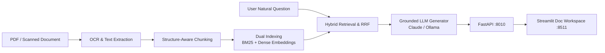

# DocSense — Enterprise Document Intelligence & Hybrid RAG Platform

<div align="center">

[](https://www.python.org/)
[](https://fastapi.tiangolo.com/)
[](https://streamlit.io/)
[](https://mlflow.org/)
[](https://www.docker.com/)
[](https://github.com/astral-sh/ruff)
[](https://pytest.org/)
[](https://opensource.org/licenses/MIT)

</div>

> **Production multimodal document intelligence platform: multi-engine OCR (scanned & digital PDFs), layout-aware chunking, hybrid BM25 + dense vector retrieval with Reciprocal Rank Fusion, and citation-grounded LLM question-answering.**

---

## 📖 Executive Summary & Value Proposition

**`docsense`** is a production-grade, end-to-end machine learning system built with strict engineering discipline, reproducible pipelines, and enterprise MLOps best practices. It bridges the gap between theoretical statistical rigor and high-availability operational microservices.

## 📑 Core Methodologies & System Architecture

### 1. Document Extraction & OCR Pipeline
- Native text extraction for digital PDFs via PyPDF.
- Automatic OCR fallback for scanned documents and images using Tesseract / PaddleOCR with deskewing and preprocessing.

### 2. Structure-Aware Chunking & Token Windowing
- Semantic boundary chunking preserving headers, paragraphs, and table boundaries.
- Sliding token window with configurable overlap preventing context fragmentation.

### 3. Hybrid Lexical-Dense Retrieval (RRF)
- Combines exact-keyword BM25 retrieval with dense vector embeddings (Sentence-Transformers).
- Merges ranked lists using Reciprocal Rank Fusion:
$$	ext{RRF}(d) = \sum_{m \in \{	ext{BM25}, 	ext{Dense}\}} rac{1}{k + r_m(d)}, \quad k = 60$$

### 4. Grounded Q&A with Provenance Citations
- Generates precise, hallucination-free answers with exact document name, page number, and source text snippets.
- Hot-swappable LLM backend supporting Anthropic Claude 3.5 Sonnet, local Ollama (Llama 3/Mistral), and deterministic mocks for CI.

## 📊 Architecture & Pipeline



## 🛠️ Tech Stack & Engineering Standards
- **AI & Retrieval:** Python 3.12, PyPDF, pdf2image, pytesseract, Sentence-Transformers, Rank-BM25, Anthropic API
- **Serving & UI:** FastAPI, Streamlit, MLflow
- **Testing:** Comprehensive Pytest suite covering loaders, chunkers, hybrid ranking, and chains


---

## 🚀 Quickstart & Setup Guide

### 1. Prerequisites & Environment Setup
Using **[uv](https://docs.astral.sh/uv/)** for lightning-fast, reproducible dependency resolution:

```bash
# Clone the repository
git clone https://github.com/jackson-marcus/docsense.git
cd docsense

# Install dependencies and pre-commit hooks
uv sync --group dev
```

### 2. Run Test Suite & Code Quality Checks
```bash
# Run unit & integration tests with coverage
uv run pytest --cov

# Run ruff linter and formatting checks
uv run ruff check .
uv run ruff format --check .
```

### 3. Launch Services Locally
```bash
# Start FastAPI REST API (listening on port :8010)
make api
# Or: uv run uvicorn docsense.api.main:app --reload --port 8010

# Start interactive Streamlit dashboard (listening on port :8511)
make ui

# Launch local MLflow Experiment Tracking UI (listening on port :5001)
make mlflow
```

### 4. Run with Docker Compose
```bash
# Spin up the complete microservice stack
docker compose up --build
```

---

## 📂 Repository Layout

```
docsense/
├── .github/workflows/ci.yml       # GitHub Actions CI pipeline (lint, test, build)
├── configs/                      # Configuration files and hyperparameters
├── data/                         # Data directory (raw, interim, processed)
├── scripts/                      # Data generators and operational scripts
├── src/docsense/               # Core Python package
│   ├── api/                      # FastAPI routes, schemas, and endpoints
│   ├── models/                   # Statistical models, ML algorithms, and estimators
│   ├── ui/                       # Streamlit interactive application
│   └── settings.py               # Centralized configuration & environment loader
├── tests/                        # Comprehensive Pytest suite
├── docker-compose.yml            # Multi-service container orchestration
├── Dockerfile                    # Container definition for API service
├── Makefile                      # Standardized project tasks
└── pyproject.toml                # Pinned dependencies and tool configs
```

---

## 👤 Author & Contact

**Jackson Marcus**
- **Email:** [jackson.marcus.work@gmail.com](mailto:jackson.marcus.work@gmail.com)
- **Upwork:** [Jackson Marcus on Upwork](https://www.upwork.com/freelancers/~012235717501ad9c7b)
- **GitHub:** [@jackson-marcus](https://github.com/jackson-marcus)

*Available for machine learning engineering, MLOps, data science, and AI system architecture consulting and contract engagements.*

